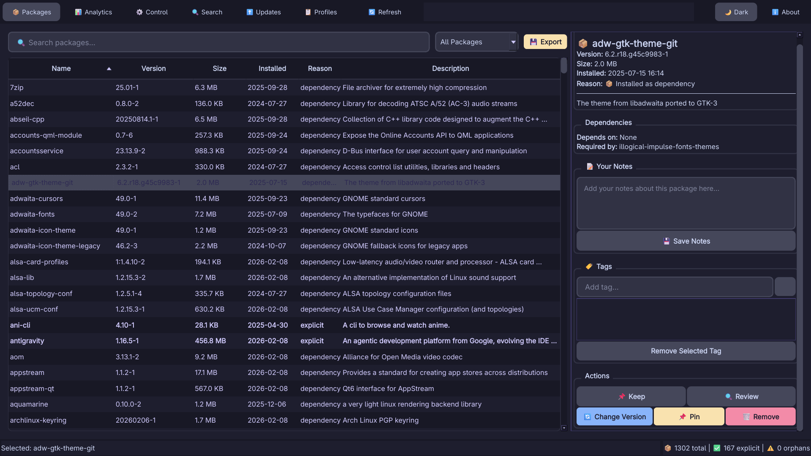
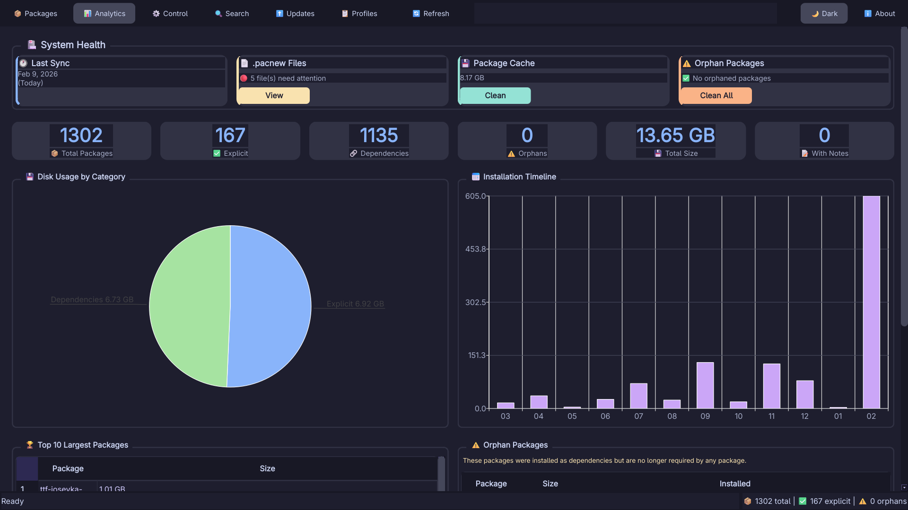
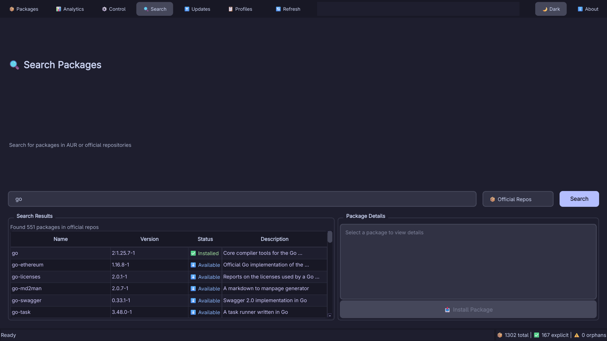
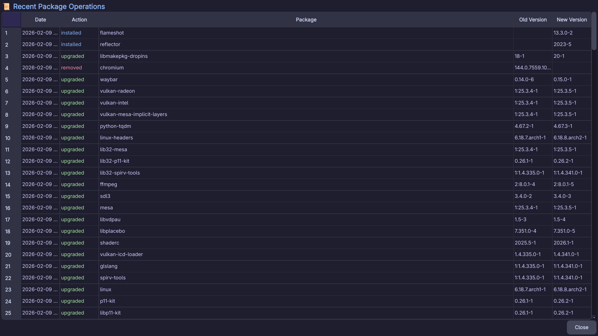
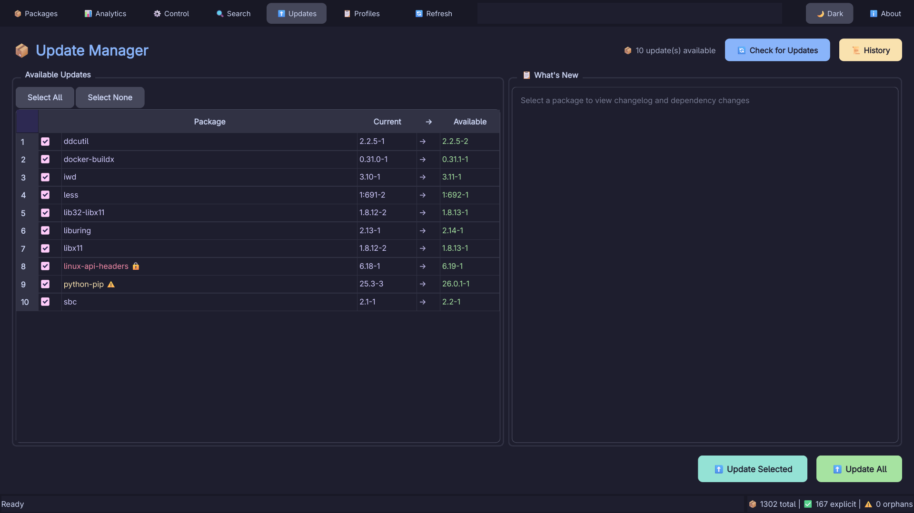
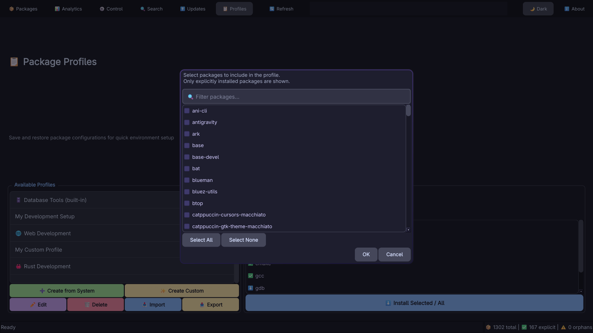

# ArchMaster 🚀

**The Ultimate Modern Package Manager Dashboard for Arch Linux.**

ArchMaster is a powerful, GUI-based package management solution designed to make managing your Arch Linux system intuitive, beautiful, and efficient. Built with C++ and Qt6, it leverages the speed of `libalpm` (Pacman) while offering advanced features found in no other manager.

---

## ✨ Key Features

### 📦 Advanced Package Management
- **Instant Search**: Blazing fast search across thousands of packages.
- **Smart Filters**: Quickly filter by `Installed`, `Upgrades`, `Orphans`, or view `All`.
- **Visual Status Indicators**:
    - ✅ **Installed**: Currently on your system.
    - ⬇️ **Available**: Ready to download.
    - ⚠️ **Orphan**: Unused dependencies that can be safely removed.
- **Deep Inspection**: View detailed metadata, dependencies (with visual graphs), licenses, and more.
- **One-Click Actions**: Install, Remove, or Upgrade packages with a single click.

### 📋 Intelligent Profile System
*Manage your software collections like a pro.*
- **Custom Profiles**: Create snapshots of your favorite software stacks (e.g., "Dev Tools", "Gaming").
- **Built-in Profiles**: Includes curated sets for Web Dev, C++, Python, and more.
- **Shadowing**: Edit any built-in profile to automatically create your own custom versions.
- **Tombstoning**: Delete built-in profiles you don't use—they vanish from your list (but can be restored via config).
- **Smart Restore**: Modified a built-in profile? The "Delete" button becomes "🔄 Reset" to restore the original.
- **Partial Install**: Select specific packages in a profile (Ctrl+Click) to install just a subset.
- **Import/Export**: Share your setups as JSON files. Perfect for syncing across machines.

### 📊 System Analytics & Health
- **Storage Visualization**: Interactive charts showing disk usage by package.
- **Distribution Stats**: Breakdown of Explicit vs. Dependency vs. Orphan packages.
- **Cache Analysis**: See how much space old package versions are taking.
- **Top Consumers**: Identify the largest packages installed on your system.

### ⚙️ Control Center
- **Maintenance Tools**:
    - 🧹 **Clean Cache**: Free up disk space.
    - 🗑️ **Remove Orphans**: Keep your system lean.
    - 🌍 **Update Mirrors**: Refresh your mirror list for speed.
- **Configuration**:
    - Toggle Parallel Downloads.
    - Enable 'Color' support in Pacman.
    - View System Logs.

### 🔍 AUR Integration
- Search and view packages from the Arch User Repository.
- *Note: AUR helper integration (yay/paru) is detected automatically.*

### 🛡️ Secure & Modern
- **Privileged Operations**: Uses Polkit for secure root actions (install/remove/update).
- **Dark Mode**: Sleek, eye-friendly dark theme enabled by default (toggle with `Ctrl+D`).
- **Responsive UI**: Adapts to your window size with smooth animations.

---

## 📸 Gallery

<div align="center">
  
  <p><em>The Main Dashboard - Browsing Packages</em></p>

  
  <p><em>System Analytics & Disk Usage</em></p>

  
  <p><em>Search Packages</em></p>

  
  <p><em>Package Installation History</em></p>

  
  <p><em>Update Manager</em></p>

  
  <p><em>Create Custom Profiles</em></p>
</div>


## ⌨️ Keyboard Shortcuts

| Shortcut | Action |
|----------|--------|
| **Navigation** | |
| `Ctrl + 1` | Go to **Packages** |
| `Ctrl + 2` | Go to **Analytics** |
| `Ctrl + 3` | Go to **Control Panel** |
| `Ctrl + 4` | Go to **Update Manager** |
| `Ctrl + 5` | Go to **Profiles** |
| **Actions** | |
| `Ctrl + F` | **Focus Search** |
| `Ctrl + R` / `F5` | **Refresh** Database |
| `Ctrl + D` | Toggle **Dark Mode** |
| `Ctrl + Q` | **Quit** App |

---

## 🛠️ Installation

### Prerequisites
ArchMaster is built for Arch Linux. You need the standard development tools and Qt6.

```bash
sudo pacman -S base-devel cmake qt6-base qt6-svg qt6-charts qt6-5compat
```

### Build Instructions

1.  **Clone the Repo**:
    ```bash
    git clone https://github.com/yourusername/archmaster.git
    cd archmaster
    ```

2.  **Compile**:
    ```bash
    cmake -B build
    cmake --build build -j$(nproc)
    ```

3.  **Run**:
    ```bash
    ./build/bin/archmaster
    ```

---

## 🤝 Contributing
Found a bug? Want to add a feature?
1.  Fork the repo.
2.  Create a feature branch.
3.  Submit a Pull Request.

## 📄 License
This project is licensed under the MIT License - see the LICENSE file for details.
